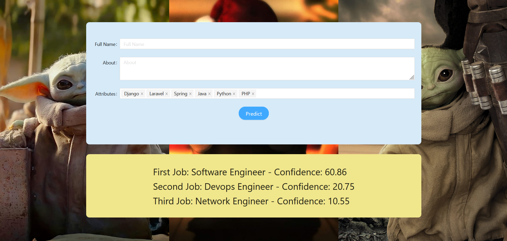

## pwa

```PWA``` is a service for front-end. It's shown below.

<p align="center">
      
</p>

### How to use
Fill the attributes with ```skills```, ```educations``` and ```experiences``` you want. ```Full name``` and ```About``` are not necessary. Then hit the ```Predict``` button to show the result.

### How to run

```bash
npm install
npm start
```